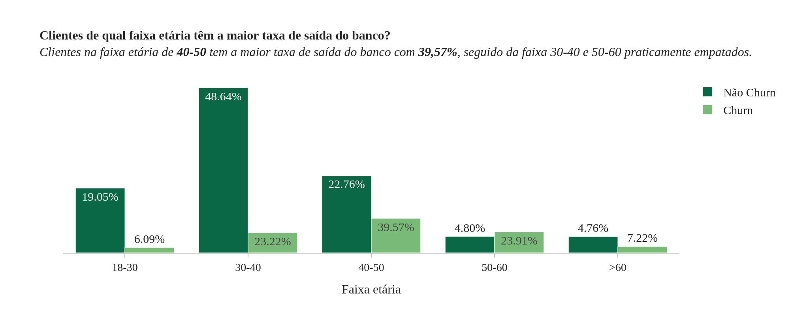
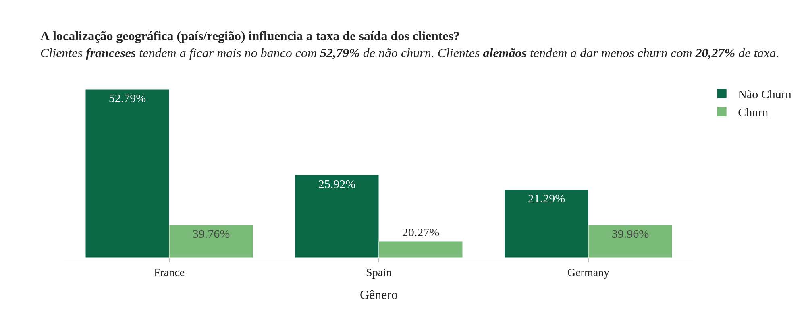
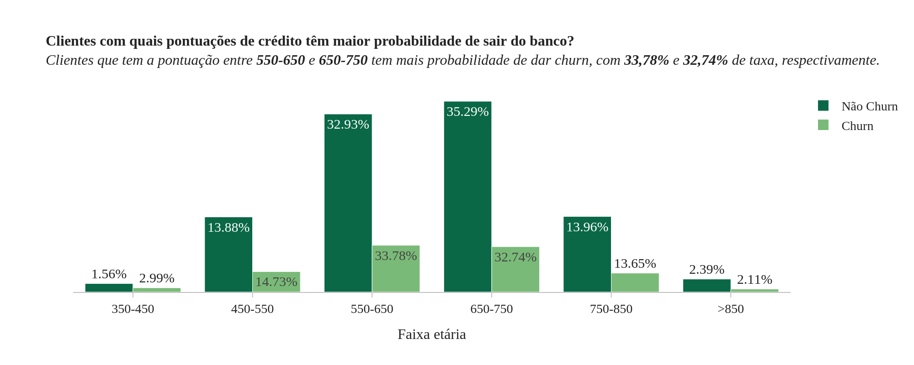
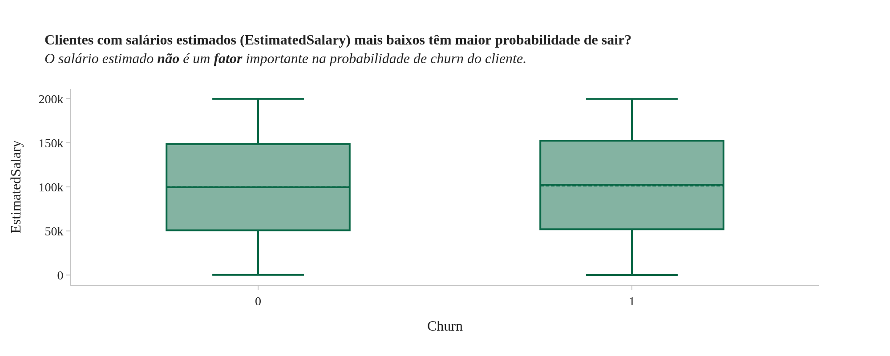
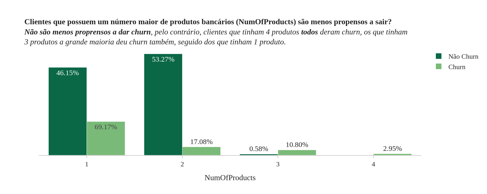
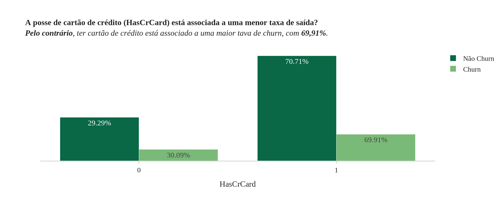
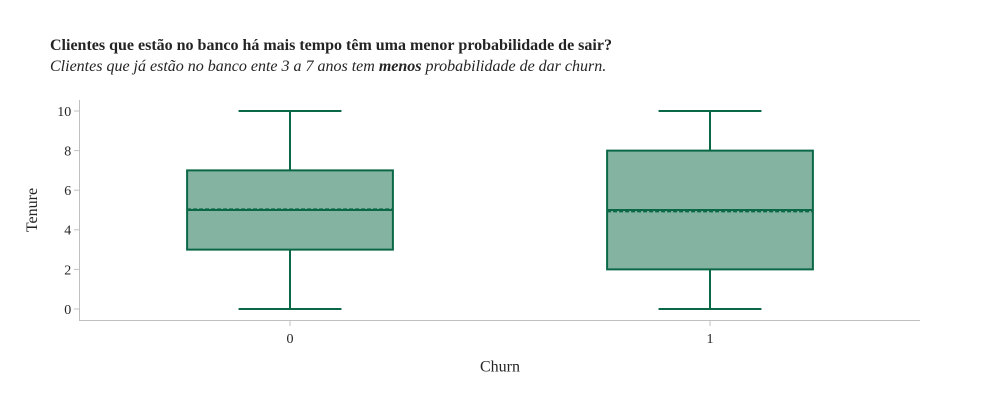
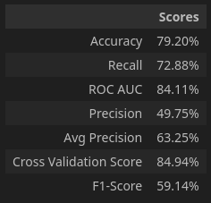
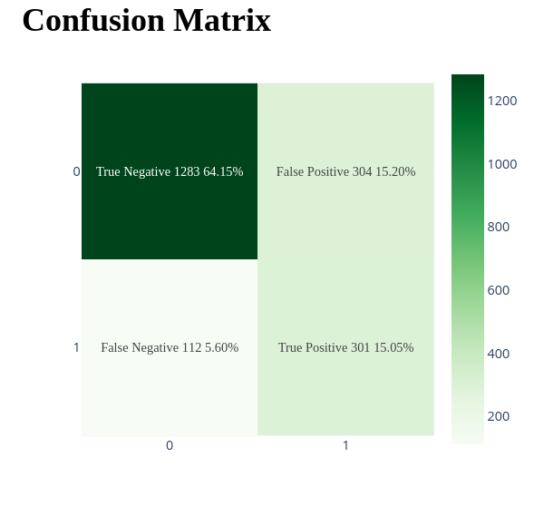

# Bank Customer Churn Prediction

.jpg)

---
## Visão geral do projeto
Nesse projeto, foi feito um modelo de machine learning usando a Regressão Logística para prever se o cliente do banco vai dar churn ou não.

### Estrura do projeto
- `data` pasta que contêm os dados
- `eda` pasta que contêm o notebook da análise exploratória
- `modeling` pasta que contêm o notebbok da modelagem
- `src` pasta que contêm as imagens que são usadas no readme.

---
## Descrição do problema
Um banco quer desenvolver uma solução, utilizando machine learning, para prever se um cliente vai dar churn ou não.

---
## Análise Exploratória

### Sobre o dataset
Este conjunto de dados contém informações sobre os clientes de um banco e o status de churn desses clientes.  

Link dataset: https://www.kaggle.com/datasets/saurabhbadole/bank-customer-churn-prediction-dataset

### Principais insights

---
## Modelagem
Para construir a solução foram testados os seguintes modelos:
- Logistic Regression
- Decision Tree Classifier
- XGBoost Classifier
- Random Forest Classifier  

Para medir qual modelo teve a melhor performance, foram utilizadas métricas e técnicas, como a validação cruzada.  

O modelo que performou melhor foi a Random Forest Classifier, com os seguintes resultados:

---
## Conclusão
O objetivo desse projeto, era desenvolver uma solução usando machine learning para prever se um cliente do banco vai dar churn ou não. O modelo que desempenhou a melhor performance foi o Random Forest Classifier.